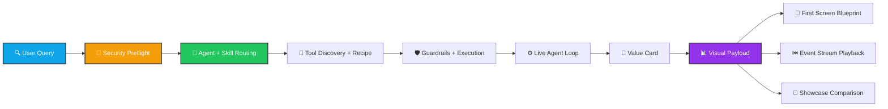

<p align="center">
  
</p>

<p align="center">
  <b>A multi-agent system where each agent dynamically selects complementary skills with full routing trace.</b>
</p>

<p align="center">
  
  
  
  
</p>

<p align="center">
  
  
  
  
</p>

---

## 🚀 What Makes Agent Harness Legendary?

<table align="center">
<tr>
<td align="center" width="25%">
⚡<br/><strong>Smart Routing</strong><br/>Dynamic agent + skill selection
</td>
<td align="center" width="25%">
📊<br/><strong>Visual First</strong><br/>Built-in dashboards & charts
</td>
<td align="center" width="25%">
🛡️<br/><strong>Security Core</strong><br/>Preflight + guardrails
</td>
<td align="center" width="25%">
🎯<br/><strong>Value Driven</strong><br/>KPI scoring system
</td>
</tr>
</table>

---

## 🎨 Visual Magic Inside

This isn't just another agent framework—it's a **complete visual data engine** baked in from day one:

| Feature | Power | Wow Factor |
|---------|-------|-----------|
| 📈 **Value Scoring** | `reliability + observability + adaptability + safety + innovation` | Real-time KPI dashboard |
| 🎯 **Hero Cards** | Radar, timeline, discovery board, security lane, network graph | Enterprise-grade visuals |
| 📐 **First-Screen Blueprint** | Panel layout + motion hints + refs | Ready for frontend |
| ⏱️ **Event Stream** | Replay-ready timeline for animated storytelling | Live replay capability |
| 🏆 **Scenario Packs** | One-click multi-run comparison | Prove ROI instantly |
| 🤖 **Auto Optimizer** | Find best `mode + recipe` config per query | Adaptive learning |
| 🔄 **Real Agent Loop** | analyze → synthesize → critique (budget-aware) | True reasoning flow |

---

## 🏗️ Architecture Flow



---

## 🎯 Visual Export Power Map

| You Need to Show | Already Exported | Data Source |
|---|---|---|
| 💰 KPI Hero Strip | `kpis` + `value_index` | `harness-value` / `harness-visual` |
| 🕷️ Radar Chart | `radar.labels` + `radar.values` | `harness-visual` |
| 📅 Gantt Timeline | `timeline[]` with step status | `harness-visual` |
| 🎲 Discovery Scatter | `discovery_board[]` (score/novelty/risk) | `harness-visual` |
| 🚨 Security Lane | `security_board` (preflight + actions) | `harness-visual` |
| 🕸️ Force Graph | `tool_network.nodes/links` | `harness-visual` |
| 🎬 Animated Replay | `event_stream[]` with timestamps | `harness-stream` |
| 🤖 Real-Agent Panel | `live_agent_board` | `harness-live` / `harness-visual --live-agent` |
| 🏆 Multi-Scenario Leaderboard | `comparison.rows` + `best` | `harness-showcase` |
| 🎯 Best Strategy Recommendation | `best + recommendation` | `harness-optimize` |

---

## ⚙️ Real Agent Setup

The live loop uses an OpenAI-compatible endpoint.

```bash
# 🔑 Environment variables (recommended)
set AGENT_HARNESS_MODEL_BASE_URL=https://your-endpoint/v1
set AGENT_HARNESS_MODEL_API_KEY=your_api_key
set AGENT_HARNESS_MODEL_NAME=your_model

# 🔍 Inspect masked config
python -m app.main harness-live-config
```

### 🛡️ Hard Safety Rules

- 📊 Each experiment run is capped (`--max-total-calls <= 50`)
- 💬 Each query run is capped (`--max-model-calls <= 50`)
- 📝 Live summaries are logged to `data/live_experiment_log.json`

---

## 🚀 Quick Start (30 seconds)

```bash
pip install -r requirements.txt
python -m app.main run "Compare two rollout plans and highlight compliance risk"
```

---

## ✨ One-Liners That Generate "Wow" Data

```bash
# 💎 Value card (headline KPI section)
python -m app.main harness-value "compare safe rollout strategies" --json

# 📊 Full visual payload (single-run dashboard)
python -m app.main harness-visual "map ecosystem opportunities" --output reports/visual.json

# 🎨 First-screen blueprint (layout + motion hints)
python -m app.main harness-blueprint "audit governance posture" --output reports/blueprint.json

# 🎬 Event playback stream (animation timeline)
python -m app.main harness-stream "audit governance posture" --output reports/stream.json

# 🏆 Multi-scenario showcase (side-by-side comparison)
python -m app.main harness-showcase --pack impact-lens --output reports/showcase.json

# 🤖 Auto-select best mode + recipe
python -m app.main harness-optimize "design a safe and innovative rollout strategy" --output reports/optimize.json

# 🔄 Real-agent run (analyze → synthesize → critique)
python -m app.main harness-live "audit governance posture and propose decision memo" --max-model-calls 10

# ⚖️ Baseline vs live A/B experiment
python -m app.main harness-live-experiment --max-total-calls 40 --max-calls-per-query 8 --output reports/live_ab.json

# 📈 Real-agent visual payload in one shot
python -m app.main harness-visual "map safe growth strategy" --live-agent --max-model-calls 8 --output reports/live_visual.json

# 📜 Inspect iteration history
python -m app.main harness-live-history --limit 20

# 🔌 Explicit provider override
python -m app.main harness-live "evaluate launch risk" --model-base-url https://yunwu.ai/v1 --model-name gemini-3-flash-preview
```

# 📦 Real Payload Glimpse

```json
{
  "kpis": {
    "value_index": 86.63,
    "reliability": 0.85,
    "safety": 0.72,
    "innovation": 0.91
  },
  "radar": {
    "labels": ["reliability", "observability", "adaptability", "safety", "innovation"],
    "values": [85.0, 84.0, 88.0, 72.0, 91.0]
  },
  "hero_cards": [
    {"title": "🔧 Reliability Signal", "headline": "85% reliable execution"},
    {"title": "🛡️ Safety Signal", "headline": "72% safety posture"},
    {"title": "💡 Innovation Signal", "headline": "91% innovation density"}
  ]
}
```

---

## 🎭 Showcase Packs

| Pack | Storyline | Best For |
|---|---|---|
| 🎯 `impact-lens` | governance + ecosystem + architecture evolution | investor/demo first screen |
| 🔐 `security-first` | attack defense + constrained audit flow | enterprise/security buyers |

### List all packs:
```bash
python -m app.main harness-showcase-packs
```

---

## 📁 Core Harness Files

```
app/harness/
├── 🎯 manifest.py         (entry point)
├── 🔍 discovery.py        (tool discovery)
├── 🔐 security.py         (security preflight)
├── 📋 recipes.py          (execution recipes)
├── 💎 value.py            (KPI scoring)
├── 🎨 visuals.py          (visual exports)
├── 🎭 presentation.py     (UI layout)
├── ⏱️ stream.py            (event stream)
├── 🏆 showcase.py         (scenario comparison)
├── 🤖 optimizer.py        (auto selection)
├── 🔄 live_agent.py       (real agent loop)
├── ⚖️ live_experiment.py   (A/B testing)
├── 📜 iteration.py        (history tracking)
└── ⚙️ engine.py           (core engine)
```

### Documentation & Examples:
- 📖 `examples/visual_payload_contract.md`
- 📋 `examples/harness_recipe.sample.json`

---

## 🏷️ GitHub Topics

`ai` • `llm` • `agent` • `multi-agent` • `langchain` • `agent-framework` • `agent-routing` • `skill` • `tools` • `orchestration` • `harness` • `evaluation`

---

## 💡 Why Build Your Demo with Agent Harness?

<table>
<tr>
<td>
<h3>✅ You Get Everything</h3>

1. 📊 **The Numbers** — Value KPI scores
2. 📖 **The Narrative** — Hero cards + storyline
3. 🎬 **The Motion** — Event stream + replay
4. 🎨 **The Skeleton** — First-screen blueprint
5. 🏆 **The Proof** — Multi-scenario comparison + recommendation

</td>
<td>
<h3>🚀 Deploy Today</h3>

No need to build dashboards from scratch. This repo gives you:

- ✨ **Production-ready visuals**
- 🎯 **KPI calculations**
- 🔐 **Security best practices**
- 📈 **Comparison framework**
- 🤖 **Agent orchestration**

</td>
</tr>
</table>

---

<p align="center">
  <strong>🌟 Build once. Ship visuals that matter. 🌟</strong><br/>
  <a href="https://github.com/haorui-harry/agent-harness/stargazers">⭐ Star this repo if it helped!</a>
</p>
