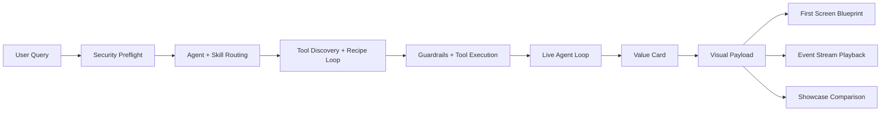

<p align="center">
  
</p>

<p align="center">
  <b>A multi-agent system where each agent dynamically selects complementary skills with full routing trace.</b>
</p>

<p align="center">
  
  
  
  
</p>

<p align="center">
  
  
  
  
</p>

## Why This Repo Turns Heads

Most agent repos stop at "it runs."  
This one ships the data model that powers high-impact visuals from day one:

- Value scoring: `reliability + observability + adaptability + safety + innovation`
- Front-end protocol: radar, timeline, discovery board, security lane, network graph, hero cards
- First-screen blueprint: panel layout + refs + motion hints
- Event stream: replay-ready timeline for animated storytelling
- Scenario packs: one-click multi-run comparison to prove business value
- Auto optimizer: find best `mode + recipe` config per query
- Real agent loop: analyze -> synthesize -> critique with strict call budgets

## First Screen Architecture



## Visual Demo Power Map

| You Need to Show | Already Exported | Data Source |
|---|---|---|
| KPI hero strip | `kpis` + `value_index` | `harness-value` / `harness-visual` |
| Radar chart | `radar.labels` + `radar.values` | `harness-visual` |
| Gantt timeline | `timeline[]` with step status | `harness-visual` |
| Discovery scatter | `discovery_board[]` (score/novelty/risk) | `harness-visual` |
| Security lane | `security_board` (preflight + step actions) | `harness-visual` |
| Force graph | `tool_network.nodes/links` | `harness-visual` |
| Animated replay | `event_stream[]` with timestamps | `harness-stream` |
| Real-agent panel | `live_agent_board` | `harness-live` / `harness-visual --live-agent` |
| Multi-scenario leaderboard | `comparison.rows` + `best` | `harness-showcase` |
| Best strategy recommendation | `best + recommendation` | `harness-optimize` |

## Real Agent Setup

The live loop uses an OpenAI-compatible endpoint.

```bash
# environment variables (recommended)
set AGENT_HARNESS_MODEL_BASE_URL=https://your-endpoint/v1
set AGENT_HARNESS_MODEL_API_KEY=your_api_key
set AGENT_HARNESS_MODEL_NAME=your_model

# inspect masked config
python -m app.main harness-live-config
```

Hard safety rule in this repo:

- each experiment run is capped (`--max-total-calls <= 50`)
- each query run is capped (`--max-model-calls <= 50`)
- live experiment summaries are appended to `data/live_experiment_log.json`

## Quick Start

```bash
pip install -r requirements.txt
python -m app.main run "Compare two rollout plans and highlight compliance risk"
```

## One-Liners That Generate "Wow" Data

```bash
# 1) Value card (great for headline KPI section)
python -m app.main harness-value "compare safe rollout strategies" --json

# 2) Full visual payload (single-run dashboard data)
python -m app.main harness-visual "map ecosystem opportunities" --output reports/visual.json

# 3) First-screen blueprint (layout + motion hints)
python -m app.main harness-blueprint "audit governance posture" --output reports/blueprint.json

# 4) Event playback stream (animation timeline)
python -m app.main harness-stream "audit governance posture" --output reports/stream.json

# 5) Multi-scenario showcase (side-by-side comparison)
python -m app.main harness-showcase --pack impact-lens --output reports/showcase.json

# 6) Auto-select best mode + recipe for this query
python -m app.main harness-optimize "design a safe and innovative rollout strategy" --output reports/optimize.json

# 7) Real-agent run (analyze -> synthesize -> critique)
python -m app.main harness-live "audit governance posture and propose decision memo" --max-model-calls 10

# 8) Baseline vs live A/B experiment (strict 50-call ceiling)
python -m app.main harness-live-experiment --max-total-calls 40 --max-calls-per-query 8 --output reports/live_ab.json

# 9) Real-agent visual payload in one shot
python -m app.main harness-visual "map safe growth strategy" --live-agent --max-model-calls 8 --output reports/live_visual.json

# 10) Inspect iteration history from previous live experiments
python -m app.main harness-live-history --limit 20

# 11) Explicit provider override (OpenAI-compatible endpoint)
python -m app.main harness-live "evaluate launch risk" --model-base-url https://yunwu.ai/v1 --model-name gemini-3-flash-preview
```

## Real Payload Glimpse

```json
{
  "kpis": {
    "value_index": 86.63,
    "reliability": 0.85,
    "safety": 0.72,
    "innovation": 0.91
  },
  "radar": {
    "labels": ["reliability", "observability", "adaptability", "safety", "innovation"],
    "values": [85.0, 84.0, 88.0, 72.0, 91.0]
  },
  "hero_cards": [
    {"title": "Reliability Signal", "headline": "85% reliable execution"},
    {"title": "Safety Signal", "headline": "72% safety posture"},
    {"title": "Innovation Signal", "headline": "91% innovation density"}
  ]
}
```

## Showcase Packs

| Pack | Storyline | Best For |
|---|---|---|
| `impact-lens` | governance + ecosystem + architecture evolution | investor/demo first screen |
| `security-first` | attack defense + constrained audit flow | enterprise/security buyers |

List packs:

```bash
python -m app.main harness-showcase-packs
```

## Core Harness Files

- `app/harness/manifest.py`
- `app/harness/discovery.py`
- `app/harness/security.py`
- `app/harness/recipes.py`
- `app/harness/value.py`
- `app/harness/visuals.py`
- `app/harness/presentation.py`
- `app/harness/stream.py`
- `app/harness/showcase.py`
- `app/harness/optimizer.py`
- `app/harness/live_agent.py`
- `app/harness/live_experiment.py`
- `app/harness/iteration.py`
- `app/harness/engine.py`

Visual protocol docs:

- `examples/visual_payload_contract.md`
- `examples/harness_recipe.sample.json`

## Suggested GitHub Topics

`ai`, `llm`, `agent`, `multi-agent`, `langchain`, `agent-framework`, `agent-routing`, `skill`, `tools`, `orchestration`, `harness`, `evaluation`

---

If you are building a flashy demo page, this repo already gives you:

1. The numbers (value KPI)
2. The narrative (hero cards + storyline)
3. The motion timeline (event stream)
4. The visual skeleton (first-screen blueprint)
5. The proof (multi-scenario comparison + optimizer recommendation)
