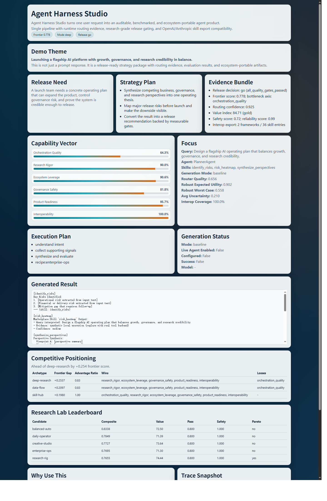

  
  

# Demo Snapshots

These are tracked showcase snapshots that ship with the repository.

`reports/` is runtime output and intentionally gitignored.

## Live Launch Snapshot

- HTML snapshot: [live/showcase.html](./live/showcase.html)
- Press brief: [live/press-brief.md](./live/press-brief.md)
- JSON payload: [live/showcase.json](./live/showcase.json)
- Interop bundle: [live/interop_bundle.json](./live/interop_bundle.json)

## Baseline Snapshot

- HTML snapshot: [press/showcase.html](./press/showcase.html)
- Press brief: [press/press-brief.md](./press/press-brief.md)
- JSON payload: [press/showcase.json](./press/showcase.json)
- Interop bundle: [press/interop_bundle.json](./press/interop_bundle.json)
