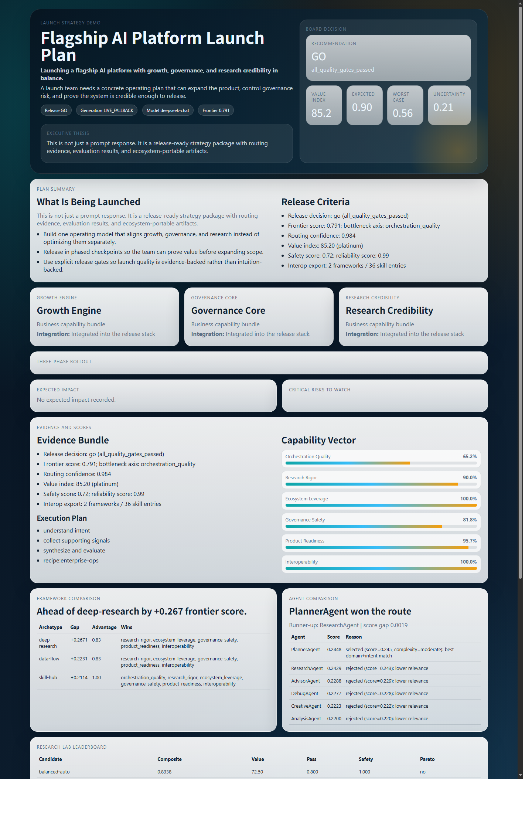
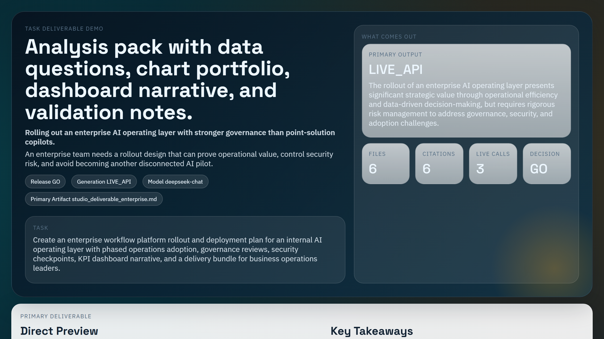
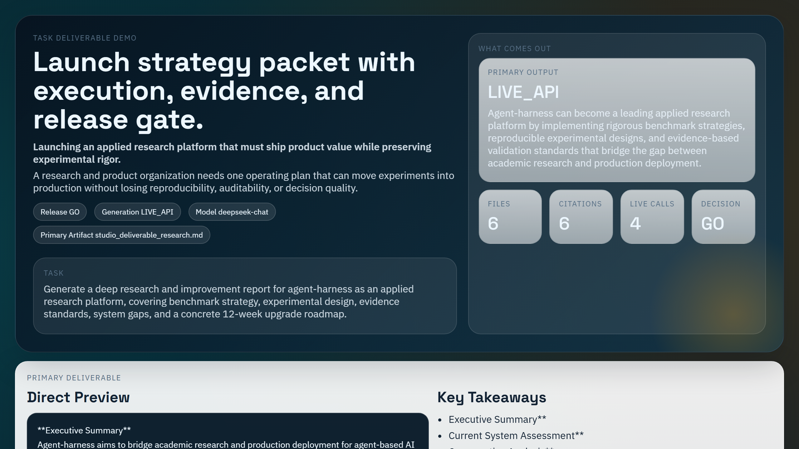



  
  

# Demo 快照

这里放的是随仓库一起提交的 showcase 快照。

`reports/` 是本地运行时输出，默认不提交到仓库。

## 1. 实时金融发布包

- 主题：受监管 AI 客服 copilot 发布
- 主交付物：[live/deliverable.md](./live/deliverable.md)
- HTML 快照：[live/showcase.html](./live/showcase.html)
- Press Brief：[live/press-brief.md](./live/press-brief.md)
- JSON 载荷：[live/showcase.json](./live/showcase.json)
- Interop Bundle：[live/interop_bundle.json](./live/interop_bundle.json)

## 2. 企业 rollout 套件

- 主题：企业 AI operating layer 推广
- 主交付物：[enterprise/deliverable.md](./enterprise/deliverable.md)
- HTML 快照：[enterprise/showcase.html](./enterprise/showcase.html)
- Press Brief：[enterprise/press-brief.md](./enterprise/press-brief.md)
- JSON 载荷：[enterprise/showcase.json](./enterprise/showcase.json)
- Interop Bundle：[enterprise/interop_bundle.json](./enterprise/interop_bundle.json)

## 3. 研究晋升包

- 主题：应用研究晋升与发布决策
- 主交付物：[research/deliverable.md](./research/deliverable.md)
- HTML 快照：[research/showcase.html](./research/showcase.html)
- Press Brief：[research/press-brief.md](./research/press-brief.md)
- JSON 载荷：[research/showcase.json](./research/showcase.json)
- Interop Bundle：[research/interop_bundle.json](./research/interop_bundle.json)

## 4. Baseline Press 快照

这个旧快照保留为 CI 安全的基线。

- HTML 快照：[press/showcase.html](./press/showcase.html)
- Press Brief：[press/press-brief.md](./press/press-brief.md)
- JSON 载荷：[press/showcase.json](./press/showcase.json)
- Interop Bundle：[press/interop_bundle.json](./press/interop_bundle.json)
